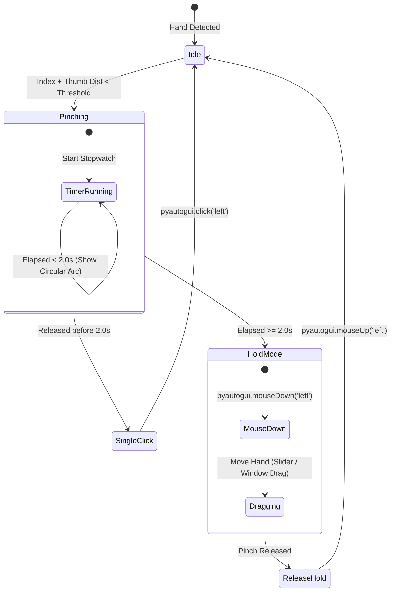

# 🖐️ Hand-Movement-Detected-Working-Mouse Pro

<div align="center">

[](https://www.python.org/)
[](https://developers.google.com/mediapipe)
[](https://opencv.org/)
[](https://github.com/Bisman-Singh-Dev/Hand-Movement-Detected-Working-Mouse)
[](https://github.com/Bisman-Singh-Dev/Hand-Movement-Detected-Working-Mouse/releases)
[](LICENSE)

<br/>

**Transform your standard webcam into an ultra-responsive, zero-latency AI-powered virtual mouse.**  
Navigate, click, scroll, and drag sliders seamlessly using natural hand gestures.

[Download Standalone .EXE](#-instant-download--quickstart) • [Gesture Controls](#-intuitive-gesture-controls) • [System Architecture](#-technical-architecture) • [Customization](#%EF%B8%8F-configuration--tuning)

---

</div>

## 🌟 Overview

**Hand-Movement-Detected-Working-Mouse Pro** bridges cutting-edge computer vision with desktop human-computer interaction (HCI). Using Google MediaPipe’s 21-point 3D hand skeletal landmark estimation and an adaptive exponential smoothing filter, this software allows you to control your PC cursor without physical hardware.

Unlike traditional gesture mouses that suffer from jitter or accidental clicks, this system introduces a **time-based state machine**:
* **Quick Pinch (< 2.0s)**: Registers an instant, crisp left mouse click upon release.
* **Sustained Pinch (≥ 2.0s)**: Engages a persistent **Hold-and-Drag state** (`mouseDown`), allowing you to smoothly drag sliders, move windows, highlight text, and perform drag-and-drop actions. Releasing your fingers immediately releases the hold (`mouseUp`).

---

## 🚀 Key Highlights & Features

- **🎯 Jitter-Free Sub-Pixel Smoothing:** Implements an Exponential Moving Average (EMA) filter combined with velocity dampening to eliminate webcam sensor noise and hand tremors.
- **🤏 Pinch-to-Click:** Natural pinch gesture between the index finger tip and thumb tip.
- **⏱️ 2-Second Hold & Drag (Slider Mode):** Holding pinch for 2 seconds transitions from click mode to continuous drag. An on-screen circular progress ring fills up in real time to indicate transition.
- **💻 Full Screen Reachability:** Configurable active tracking margin maps hand movement comfortably without forcing you to reach beyond your camera's field of view.
- **⚡ Dual-Finger Scroll:** Extend index and middle fingers together to scroll web pages, documents, and code editors vertically.
- **🖱️ Smart Right Click:** Middle-finger-to-thumb pinch triggers contextual right-click.
- **🌌 Futuristic HUD Overlay:** Cyberpunk-inspired real-time telemetry displaying:
  - 360° circular progress ring tracking pinch hold time (0.0s → 2.0s)
  - Pulsating amber aura during active drag/slider interaction
  - Active boundary box with glowing corner reticles
  - Real-time FPS counter, cursor coordinates, and state pill badges
  - Click ripple feedback animations
- **📦 Zero-Dependency Standalone `.exe`:** Pre-compiled Windows executable ready to run immediately without installing Python or configuring pip environments.

---

## 🎮 Intuitive Gesture Controls

| Gesture | Movement | Action | State Feedback |
| :--- | :--- | :--- | :--- |
| **Move Cursor** | Move Index Finger across active region | Moves cursor smoothly | `TRACKING` (Emerald) |
| **Left Click** | Quick pinch Index + Thumb and release (< 2.0s) | Performs standard Left Click | `CLICK!` (White Ripple) |
| **Hold & Drag** | Pinch Index + Thumb and hold continuously ≥ 2.0s | Locks mouse button down (`mouseDown`) for sliders & dragging | `HOLD / SLIDER ACTIVE` (Amber Aura) |
| **Release Drag** | Open fingers after holding | Releases mouse button (`mouseUp`) | `HOLD_RELEASE` |
| **Right Click** | Pinch Middle Finger + Thumb and release | Opens contextual right-click menu | `RIGHT CLICK` (Purple) |
| **Page Scroll** | Raise Index + Middle fingers together and glide up/down | Smooth vertical scrolling | `SCROLLING` |



---

## 📦 Instant Download & Quickstart

### Option 1: Standalone Windows Executable (.exe) — Recommended

No Python or terminal required!

1. Download **`HandMousePro.exe`** directly from the [Releases Page](https://github.com/Bisman-Singh-Dev/Hand-Movement-Detected-Working-Mouse/releases) or the `dist/` directory.
2. Double-click **`HandMousePro.exe`** to launch.
3. Position your hand inside the webcam frame and start navigating!

> **Note on Windows SmartScreen:** Because this is an unsigned open-source utility that controls the mouse cursor, Windows Defender might prompt `Windows protected your PC`. Simply click **More info** ➔ **Run anyway**.

---

### Option 2: Run from Source (Developers)

#### Prerequisites
* Windows 10/11
* Python 3.10 or 3.11 installed (`python --version`)
* A working USB or integrated webcam

#### 1. Clone the Repository
```bash
git clone https://github.com/Bisman-Singh-Dev/Hand-Movement-Detected-Working-Mouse.git
cd Hand-Movement-Detected-Working-Mouse
```

#### 2. Automatic One-Click Launch (Windows)
Simply double click `run.bat` or run in Command Prompt:
```cmd
run.bat
```
*(The script automatically creates a virtual environment, installs dependencies, and boots the application).*

#### 3. Manual Installation
```bash
# Create and activate virtual environment
python -m venv venv
.\venv\Scripts\activate

# Install required dependencies
pip install -r requirements.txt

# Launch application
python main.py
```

---

## ⌨️ Hotkeys & In-App Shortcuts

When the camera preview window is focused:

| Key | Function |
| :--- | :--- |
| `Q` or `ESC` | Cleanly terminate application and release all mouse locks |
| `P` | Pause / Resume hand tracking |
| `H` | Toggle HUD graphics on / off (reduces CPU usage) |
| `R` | Emergency reset of depressed mouse states |

---

## 🛠️ Configuration & Tuning

All sensitivity parameters, gesture timings, and display options are cleanly centralized in `config.py`.

```python
# config.py
@dataclass
class AppConfig:
    # Camera settings
    CAMERA_INDEX: int = 0
    CAMERA_WIDTH: int = 640
    CAMERA_HEIGHT: int = 480
    FLIP_HORIZONTAL: bool = True  # Mirror view

    # Active tracking boundary margin
    FRAME_MARGIN_X: int = 90
    FRAME_MARGIN_Y: int = 70

    # Smoothing & Movement (Higher = smoother, Lower = faster)
    SMOOTHING_FACTOR: float = 5.0

    # Gestures
    PINCH_THRESHOLD: float = 0.065
    HOLD_DELAY_SECONDS: float = 2.0  # Duration before Drag activates!
    MIN_CLICK_DURATION: float = 0.05 # Rejects 1-frame tracking glitches
    MAX_CLICK_DURATION: float = 1.95 # Pinch released prior is a click
```

---

## 🏗️ Technical Architecture

```
Hand-Movement-Detected-Working-Mouse/
├── core/
│   ├── __init__.py
│   ├── hand_tracker.py       # MediaPipe 21-landmark detector & Euclidean scaling
│   ├── gesture_recognizer.py # State machine managing click vs 2s hold
│   ├── mouse_controller.py   # Screen coordinate mapping, EMA smoothing & OS events
│   └── hud_renderer.py       # Real-time circular progress rings, badges & telemetry
├── assets/
│   ├── icon.ico              # Custom application binary icon
│   └── icon.png
├── config.py                 # Central configuration dataclass
├── main.py                   # Main loop & video capture pipeline
├── test_system.py            # Unit test suite verifying gestures and mapping
├── build_exe.py              # Automated PyInstaller packaging pipeline
├── run.bat                   # Instant Windows batch launcher
├── requirements.txt          # Python dependencies
└── README.md                 # Complete documentation
```

### Signal Pipeline
```
[Webcam Frame]
       │
       ▼
[Mirror & Preprocess] ──> [MediaPipe Hands 21 Landmarks]
                                   │
                                   ▼
         ┌─────────────────────────┴─────────────────────────┐
         │                                                   │
  [Landmark 8 (Index)]                            [Thumb & Index Distance]
         │                                                   │
         ▼                                                   ▼
[Coordinate Transformation]                       [Gesture State Machine]
 (Margin & Screen LERP)                                      │
         │                                                   ├─ < 2.0s ──> Left Click
         │                                                   ├─ ≥ 2.0s ──> Left Mouse Down (Drag)
         │                                                   └─ Release ─> Left Mouse Up
         │                                                   │
         └─────────────────────────┬─────────────────────────┘
                                   │
                                   ▼
                       [OS Mouse Event Dispatch]
                                   │
                                   ▼
                        [Futuristic HUD Overlay]
```

---

## 🧪 Testing

Run the automated test suite to verify coordinate transformations, gesture state transitions, and 2-second hold thresholds:
```bash
python test_system.py
```

Expected output:
```text
========================================
 Running Virtual Hand Mouse Test Suite
========================================
Testing MouseController coordinate mapping...
✅ MouseController coordinate mapping passed!
Testing quick pinch (< 2.0s) -> CLICK event...
✅ Quick pinch -> CLICK event passed!
Testing sustained pinch (>= 2.0s) -> HOLD / DRAG event...
✅ Sustained pinch -> HOLD / DRAG event passed!
Testing HUD rendering on mock frame...
✅ HUD rendering test passed!
========================================
 🎉 ALL TESTS PASSED SUCCESSFULLY!
========================================
```

---

## 🔨 Building the Standalone `.exe`

To compile a standalone single-file Windows executable:
```bash
python build_exe.py
```
The compiled binary will be placed inside `dist/HandMousePro.exe`.

---

## 🤝 Contributing

Contributions, issues, and feature requests are welcome!  
Feel free to check the [issues page](https://github.com/Bisman-Singh-Dev/Hand-Movement-Detected-Working-Mouse/issues).

1. Fork the Project
2. Create your Feature Branch (`git checkout -b feat/AmazingFeature`)
3. Commit your Changes (`git commit -m 'feat: Add AmazingFeature'`)
4. Push to the Branch (`git push origin feat/AmazingFeature`)
5. Open a Pull Request

---

## 📄 License

This project is licensed under the MIT License - see the [LICENSE](LICENSE) file for details.

---

<div align="center">
  <b>Crafted with ❤️ by <a href="https://github.com/Bisman-Singh-Dev">Bisman-Singh-Dev</a></b>
</div>